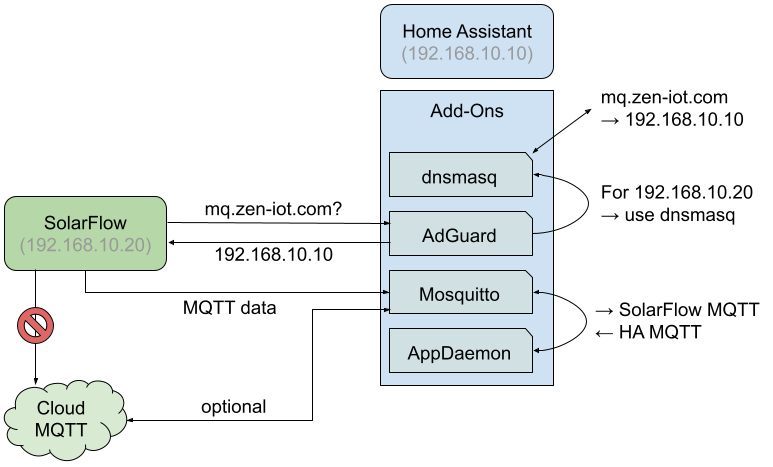

# Local SolarFlow Integration with Home Assistant

[](https://www.gnu.org/licenses/gpl-3.0)

The [Zendure SolarFlow](https://zendure.de/products/solarflow) is a system to
store solar energy to a battery to use it later, e.g., during the night. By
default, it connects to a cloud MQTT server run by the vendor and feeding data
to the app.

In this repo, you find instructions and an AppDaemon app that connects SolarFlow
*over the local network* to Home Assistant without a cloud service. It does so
by re-routing MQTT traffic to a local server and then adding a shim to translate
from SolarFlow's MQTT messages to other MQTT topics that can then be easily
consumed (and auto-configured) in Home Assistant. It also adds simple
controllers that enable to control battery output based on house consumption (if
that data is available in Home Assistant). Cloud connectivity can be retained if
desired.

> [!WARNING]
> This guide is for advanced users, in particular knowledge about computer
> networks, Python code, and Home Assistant are required. Use this at your own
> risk. You are responsible yourself should you choose to expose your device to
> this procedure.



## Overview

The basic idea is to redirect MQTT traffic from the SolarFlow to a local MQTT
server. This is achieved by running such a server and remapping the server name
of the Zendure cloud to the local server. Then a Python script that runs via
the AppDaemon add-on interacts with the device through the Zendure MQTT
messages on one side, and via MQTT to Home Assistant on the other side, using
more canonical HA topic naming and supporting auto-discovery.

The tricky part is to retrieve the MQTT access data and topic names from the
SolarFlow device.

## Retrieve Access Data
The SolarFlow uses access credentials inherent to the device, they cannot be
changed (or we don't know how). In order for it to be able to access our local
MQTT server, we need the credentials to configure the same. Luckily for us,
the connection to the Zendure cloud MQTT server is not encrypted (one more
reason to cut that connection). So to retrieve the credentials, we need to
capture the traffic between the SolarFlow and the MQTT server.

The easiest way is using a packet sniffer such as
[WireShark](https://www.wireshark.org/). Some routers may also support packet
capture. The FritzBox can do that and that's what I have used. Go to
[http://fritz.box/support.lua](http://fritz.box/support.lua). Then find the
packet capturing option and follow the link. Hit "Start" for the Internet
up-link. It will start downloading a file that contains the captured packets.

Then go to the SolarFlow and push the IOT button to disconnect it. The press
it again to connect again.

Stop the packet capture and open the resulting file in WireShark. In the line
that reads "Apply a display filter" just type "mqtt and mqtt.conflag.passwd"
and hit Enter. The remaining lines contain MQTT credentials. Click a line. On
the lower left expand the line "MQ Telemetry Transport Protocol" if not done
already. Look for "User Name:" and "Password:". Chances are you also recorded
a connection from the Zendure app (username zenApp). We are *not* interested
in these. The username and password most likely look like random gibberish.
Note down the username and password, we will use them later.

Change the display filter to `mqtt and mqtt.topic matches "/<USERNAME>/"` (
replace `<USERNAME>` by the username you just extracted before. Click and
appearing line. In the lower left, look for the topic name. It should be of
the form "/<PREFIX>/<USERNAME>/...". We need to write down what
`<PREFIX>` is. Later we will call `<USERNAME>` also `<DEVICE-ID>`.

So you should have the username, password, and the topic prefix.

## Prerequisites
For this approach to work, your **Home Assistant requires a fixed IP address**
in your local network (that is because we are going to redirect DNS traffic to
it).

## Install Mosquitto MQTT Server
Mosquitto is a common MQTT server implementation. It is readily available as a
[Home Assistant add-on](https://www.home-assistant.io/addons/). In Home
Assistant go to the [Add-Ons
page](https://my.home-assistant.io/redirect/supervisor/) (this links to your
instance if you have configured [My Home
Assistant](https://my.home-assistant.io/)) and use the button on the lower right
for the store to install Mosquitto.

Once installed, go to its Configuration page. In the "Logins" section, add an
entry like this:
```yaml
- username: <USERNAME>
  password: <PASSWORD>
```
Replace `<USERNAME>` and `<PASSWORD>` with the credentials extracted before
from the recorded MQTT section.

## Redirect SolarFlow MQTT traffic
How the traffic can be redirected is very specific to your network. I'll
outline the particular approach I have used, but your mileage may vary.

The basic idea is to redirect MQTT traffic by remapping the DNS server name
of the Zendure cloud MQTT server to our local server.

Here, we use dnsmasq to provide us with that override (it provides host
overrides out of the box and easily configurable in Home Assistant), and AdGuard
to redirect only the SolarFlow traffic to use dnsmasq as its DNS server. An
alternative is to redirect all DNS queries of your local network to dnsmasq, or
maybe add a static network configuration for SolarFlow (not tested).

### dnsmasq
dnsmasq is a DNS server which provides plenty of configuration options. Install
the [dnsmasq
add-on](https://github.com/home-assistant/addons/blob/master/dnsmasq/DOCS.md). Then
go to the add-on configuration tab in Home Assistant and to the config section
"Hosts" add something similar as the following:

```yaml
- host: mq.zen-iot.com
  ip: 192.168.1.x
```

Replace `ip` by the (fixed) IP address of Home Assistant. This will overwrite
the DNS name.

If you use AdGuard for redirecting DNS traffic (see below), change the exposed
exports ports for TCP and UDP traffic to 1053. Do not do this if you use a
static network configuration.

### AdGuard
What remains is to redirect DNS traffic from the SolarFlow to dnsmasq, so that
when SolarFlow will get our There are several ways to achieve this. The easiest
may be to configure a static IP and provide the Home Assistant IP as DNS (I
haven't tried this). Here, we use AdGuard.

AdGuard is an ad-blocker that works by modifying DNS traffic. Especially when
already using it already it's an easy way to redirect DNS traffic. It can be
installed as an [Home Assistant
add-on](https://github.com/hassio-addons/addon-adguard-home). Reconfigure your
router to perform all DNS look-ups through AdGuard ([German
how-to](https://heise.de/-9219120)).

In your DHCP server set a *fixed IP address* for your SolarFlow, or configure
it to a fixed IP.

In AdGuard, create a client configuration for that specific IP. Go to the
AdGuard Home screen (usually link in the left tab), then Settings, then Client
Settings. Click on "Add Client". Use the IP address as identifier. In the tab
"Upstream DNS Servers" (setting for the specific client in AdGuard), set
`<HA-IP>:1053`, where `<HA-IP>` is the fixed IP address of your Home Assistant
host. Note the port `1053` which is what you set up earlier in dnsmasq.

Now all DNS traffic from the SolarFlow is resolved using dnsmasq.

## Testing MQTT traffic
Now go to the SolarFlow and click the IOT button *shortly*. This will disable
the network connection. Wait a few seconds and then click to enable it
again. Now the new DNS configuration and MQTT server should be in effect. To
verify, use the following to print traffic coming from SolarFlow:

```shell
mosquitto_sub -u <USERNAME> -P <PASSWORD> -h <HA-IP> -p 1883 -t '/<PREFIX>'
```

Here, `<USERNAME>` and `<PASSWORD>` are to be replaced by the MQTT user data you
setup before (you can use the same as for the SolarFlow or add new ones to the
Mosquitto config). Replace `<HA-IP>` by Home Assistant's IP address, and
`<PREFIX>` with the prefix you determined earlier from the recorded network
traffic.

You should see periodic traffic (make sure there is something to report, to the
SolarFlow should either be charging or providing battery power). If you do not
see traffic, check that the credentials are correct, and that the network
traffic is being re-routed (there are no good tools other than a sniffer and
going through the guide again).

Once you see network traffic, you can start setting up the final piece to see
data in Home Assistant.

## AppDaemon MQTT Translation and SolarFlow Control

Some additional code is used to extract data from the MQTT stream of the
SolarFlow and make it appear automatically in Home Assistant. It also provides a
time service to the SolarFlow.

We use the [AppDaemon add-on](https://github.com/hassio-addons/addon-appdaemon)
to run this script continuously in Home Assistant. Install it to Home Assistant
through the Add-ons page of the settings. You will also need access to the file
system, for example using SSH.

### AppDaemon Setup

The script requires access to MQTT to read data from SolarFlow and send to Home
Assistant. Add new credentials to the Mosquitto configuration specific to
AppDaemon. Then, on Home Assistant, edit
`/addon_configs/*_appdaemon/appdaemon.yaml` (the `*` denotes some arbitrary
string).

```yaml
---
secrets: /homeassistant/secrets.yaml
appdaemon:
  # Update for your home location, not sure if this is required
  #latitude:
  #longitude:
  #elevation:
  #time_zone:
  plugins:
    HASS:
      type: hass
    MQTT:
      type: mqtt
      namespace: mqtt
      client_topics: NONE
      client_host: core-mosquitto
      client_port: 1883
      client_user: !secret appdaemon_mqtt_username
      client_password: !secret appdaemon_mqtt_password
http:
  url: http://127.0.0.1:5050
admin:
api:
hadashboard:
```

Then edit `/homeassistant/secrets.yaml`. You need to configure the following
entries. Provide the MQTT credentials setup for AppDaemon.

```yaml
appdaemon_mqtt_username: <APPDAEMON-MQTT-USERNAME>
appdaemon_mqtt_password: "<APPDAEMON-MQTT-PASSWORD>"
```
Restart AppDaemon and check the log to verify that everything went OK.

### SolarFlow Scripts in AppDaemon

The final step is to setup the specific scripts to translate SolarFlow data into
HA-compatible MQTT traffic and to enable (automatic) control.

First, edit `/homeassistant/secrets.yaml` to add the following:

```yaml
appdaemon_solarflow_topic_prefix: "<PREFIX>"
appdaemon_solarflow_device_id: "<DEVICE-ID>"
```

Replace `<PREFIX>` and `<DEVICE-ID>` with the values determined earlier when
analyzing the recorded MQTT data.

Next, edit `/addon_configs/*_appdaemon/apps/apps.yaml` and add the following:

```yaml
---
solarflow:
  module: solarflow
  class: SolarFlow
  topic_prefix: !secret appdaemon_solarflow_topic_prefix
  device_id: !secret appdaemon_solarflow_device_id
```

Modify the `max_output`, `controller_class`, `morning_cutoff_time`, and
`evening_rampup_time` to your liking.

Copy the `apps/solarflow.py` to the `apps` directory on HA (next to the
`apps.yaml` files).

Restart the AppDaemon add-on and watch the logs. If successful, you should see
outputs like this:

```
INFO AppDaemon: Calling initialize() for solarflow
INFO solarflow: Received serial XXX via log
INFO solarflow: Sending discovery info
INFO solarflow: Received time-sync request, replying with current time
```

You will see `time-sync` requests only occasionally, in particular when toggling
IOT on and off on the SolarFlow.

Once you see `Send discovery info`, in Home Assistant, then Settings, then
Devices & Services, then MQTT you should see "SolarFlow" and all data from your
SolarFlow in Home Assistant.

Congratulations if you made it this far, in particular if you succeeded!

### Optional: Output Controller

A second AppDaemon app enables automated output control. It assumes that an
overall total consumption of the house/apartment is available. It must be a
single float value, negative for production and positive for consumption, for
example, [reading from a power
meter](https://github.com/timn/esphome-meters/tree/main/electricity).

To enable, copy `apps/solarflow_control.py` to the AppDaemon `apps`
directory. Then add the following to `apps.yaml`. This will also add a switch to
Home Assistant to enable or disable automatic control, e.g., to temporarily
override.

```yaml
solarflow_control:
  module: solarflow_control
  class: SolarFlowControl
  max_output: 200
  # Possible controller classes:
  # - AlwaysZero:   always charge, only output when battery full
  # - MinimizeGrid: always try to maximize battery usage to minimize
  #                 consumption form the grid.
  # - NightUsage:   charge during the day, use battery during the night.
  #                 in the morning regulates and starts full charging when
  #                 either solar exceeds consumption or cutoff time reached.
  #                 Start using battery at rampup time again.
  controller_class: NightUsage
  # Arguments specific to NightUsage controller
  morning_cutoff_time: "10:30:00"
  evening_rampup_time: "17:00:00"
```

Check the script for the appropriate constants for entity IDs, in particular for
`HOUSE_POWER`.

Once loaded you should see the following in the AppDaemon log.

```
INFO AppDaemon: Calling initialize() for solarflow_control
```

## Optional: Enable Zendure Cloud and App

If you still want to be able to use the vendor cloud connection and thus the
Zendure app, you can configure Mosquitto to relay data also to the Zendure cloud
(this requires that you redirect the DNS only for SolarFlow, not your entire
network, in particular not your Home Assistant).

In the Mosquitto add-on configuration, add the following to the "Customize" box:

```yaml
active: true
folder: mosquitto
```

Then, create a file `/share/mosquitto/vendor_bridge.conf` with the following
content:

```
connection zendure-bridge
address mq.zen-iot.com:1883
remote_username <USERNAME>
remote_password <PASSWORD>
remote_clientid <DEVICE-ID>
notifications_local_only true
bridge_protocol_version mqttv31

topic # out 0 /<PREFIX>/<DEVICE-ID>/ /<PREFIX>/<DEVICE-ID>/
topic # in 0 iot/<PREFIX>/<DEVICE-ID>/ iot/<PREFIX>/<DEVICE-ID>/
```

Replace `<USERNAME>`, `<PASSWORD`, `<DEVICE-ID>`, and `<PREFIX>` with the
relevant data you acquired earlier.

This enables two-way communication. I have only had this enabled temporarily,
e.g., to find out new settings after an update. Use with caution.
